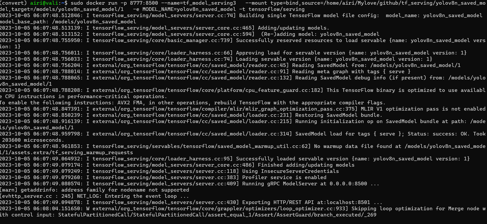

# tf-serving
# [tf_serving](https://github.com/tensorflow/serving) with [streamlit](https://streamlit.io/) and [docker](https://www.docker.com/)
TensorFlow Serving is a flexible, high-performance serving system for
machine learning models, designed for production environments. It deals with
the *inference* aspect of machine learning, taking models after *training* and
managing their lifetimes, providing clients with versioned access via
a high-performance, reference-counted lookup table.
TensorFlow Serving provides out-of-the-box integration with TensorFlow models,
but can be easily extended to serve other types of models and data.

To note a few features:

-   Can serve multiple models, or multiple versions of the same model
    simultaneously
-   Exposes both gRPC as well as HTTP inference endpoints
-   Allows deployment of new model versions without changing any client code
-   Supports canarying new versions and A/B testing experimental models
-   Adds minimal latency to inference time due to efficient, low-overhead
    implementation
-   Features a scheduler that groups individual inference requests into batches
    for joint execution on GPU, with configurable latency controls
-   Supports many *servables*: Tensorflow models, embeddings, vocabularies,
    feature transformations and even non-Tensorflow-based machine learning
    models

# Installation
Clone the repository:
``` bash
git clone https://github.com/yahyoxonqwe/tf-serving.git
```
Change into the project directory:
``` bash
cd tf-serving
```
Install the required dependencies:
``` bash
pip install -r requirements.txt
```
Docker run model ( port 8777):
``` bash
 sudo docker run -p 8777:8500 --name=tf_model_serving3   --mount type=bind,source={your_model_path},target=/models/{your_model_name}/1
 -e MODEL_NAME={your_model_name} -t tensorflow/serving
```
Docker run result like this image 


## Deploy localhost
``` bash
streamlit run stream.py --server.port 8999
```

## Demo


